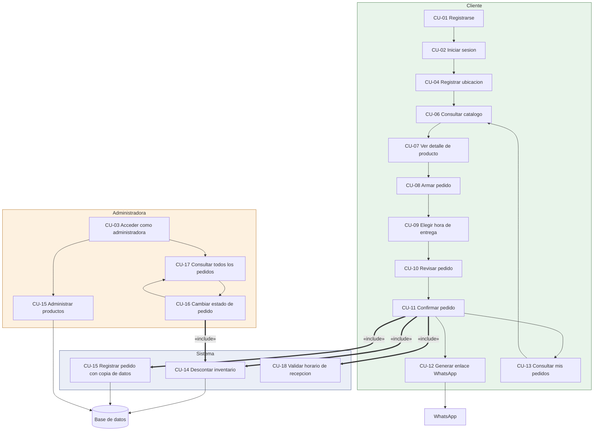

# Casos de uso — MrCatFood

| Campo | Valor |
|---|---|
| Proyecto | MrCatFood — sistema de pedidos de sándwiches |
| Tarea | M1.3 · Modelar casos de uso y entidades (casos de uso) |
| Versión | 1.0 |
| Estado | En revisión (Pull Request) |
| Documentos de origen | `docs/especificacion-requisitos.md`, `docs/historias-de-usuario.md` |

## 1. Actores del sistema

| Actor | Tipo | Descripción |
|---|---|---|
| Cliente | Humano | Compra sándwiches y consulta sus pedidos |
| Administradora | Humano | Gestiona catálogo, precios, inventario y estados de los pedidos |
| Sistema | Sistema | Valida datos, aplica reglas, descuenta inventario y genera el mensaje de WhatsApp |
| Base de datos | Sistema | Persiste usuarios, productos, pedidos y sus detalles |
| WhatsApp | Servicio externo | Transporta el pedido a la propietaria |

## 2. Diagrama general de casos de uso



**Leyenda de relaciones:** `—>` flujo opcional entre casos de uso · `==>` comportamiento obligatorio («include») · los nodos externalizados (WhatsApp, base de datos) son los que el sistema no controla.


## 3. Casos de uso del cliente

### CU-01 — Registrarse
**Actor:** Cliente · **Requisito:** RF-01 · **Precondición:** el cliente no tiene cuenta.

**Escenario principal**
1. El cliente abre la pantalla de registro.
2. El cliente ingresa nombre, correo, teléfono y contraseña.
3. El sistema valida el formato de los datos.
4. El sistema verifica que el correo no esté registrado.
5. El sistema cifra la contraseña y guarda la cuenta.
6. El sistema genera un token de acceso y lo entrega al cliente.

**Escenarios alternativos**
- **A1.** El correo ya está registrado → el sistema informa que está en uso. *Extensión en el paso 4.*
- **A2.** Los datos no cumplen el formato → el sistema señala el campo con el error. *Extensión en el paso 3.*

**Postcondición:** la cuenta existe con rol de cliente. El registro público nunca asigna rol administrativo.

### CU-02 — Iniciar sesión
**Actor:** Cliente · **Requisito:** RF-01 · **Precondición:** la cuenta existe.

**Escenario principal**
1. El cliente ingresa correo y contraseña.
2. El sistema busca la cuenta y verifica la contraseña.
3. El sistema genera un token de acceso con el rol correspondiente.
4. El cliente accede a la aplicación.

**Escenarios alternativos**
- **A1.** Las credenciales no coinciden → el sistema rechaza el acceso sin indicar cuál dato falló.

**Postcondición:** existe una sesión activa para el cliente.

### CU-03 — Acceder como administradora
**Actor:** Administradora · **Requisito:** RF-01, RNF-01 · **Precondición:** la cuenta administrativa existe.

**Escenario principal**
1. La administradora ingresa sus credenciales en la pantalla de acceso administrativo.
2. El sistema verifica las credenciales y comprueba el rol.
3. El sistema habilita las funciones administrativas.
4. La administradora también puede usar el flujo de cliente.

**Postcondición:** sesión activa con rol administrativo.

### CU-04 — Registrar ubicación
**Actor:** Cliente · **Requisito:** RF-02 · **Precondición:** el cliente tiene sesión iniciada.

**Escenario principal**
1. El cliente ingresa a su perfil.
2. Escribe su conjunto residencial y su apartamento.
3. El sistema valida que ambos campos tengan contenido.
4. El sistema guarda los datos en el perfil.

**Escenarios alternativos**
- **A1.** Alguno de los campos está vacío → el sistema indica cuál falta.

**Postcondición:** la ubicación queda disponible para el pedido.

### CU-06 — Consultar catálogo
**Actor:** Cliente · **Requisito:** RF-03, RF-04, RF-05 · **Precondición:** ninguna.

**Escenario principal**
1. El cliente abre el catálogo.
2. El sistema obtiene los productos activos.
3. El sistema muestra nombre, descripción, precio, ingredientes y disponibilidad de cada uno.

**Escenarios alternativos**
- **A1.** No hay productos activos → el sistema informa que no hay sándwiches disponibles.

**Postcondición:** ninguna; es una consulta de solo lectura.

### CU-07 — Ver detalle de producto
**Actor:** Cliente · **Requisito:** RF-04 · **Precondición:** el producto está activo.

**Escenario principal**
1. El cliente selecciona un producto del catálogo.
2. El sistema muestra la información completa del producto.

**Escenarios alternativos**
- **A1.** El producto no existe o está inactivo → el sistema responde que no existe.

### CU-08 — Armar pedido
**Actor:** Cliente · **Requisito:** RF-06 · **Precondición:** sesión iniciada y productos disponibles.

**Escenario principal**
1. El cliente selecciona productos del catálogo.
2. El cliente indica la cantidad de cada uno, dentro de la disponibilidad.
3. El sistema calcula el subtotal y el total.

**Escenarios alternativos**
- **A1.** La cantidad supera la disponibilidad → el sistema limita la cantidad al máximo disponible.

**Postcondición:** existe un pedido en borrador en el cliente, aún no registrado en la base.

### CU-09 — Elegir hora de entrega
**Actor:** Cliente · **Requisito:** RF-07, RNF-03 · **Precondición:** hay un pedido en borrador.

**Escenario principal**
1. El cliente selecciona fecha y hora de entrega.
2. El sistema valida que la fecha sea futura.
3. El sistema valida que la hora esté dentro de la ventana de entrega.
4. El cliente puede añadir notas.
5. El sistema registra los datos en el borrador.

**Escenarios alternativos**
- **A1.** La fecha ya pasó → el sistema la rechaza.
- **A2.** La hora está fuera de la ventana → el sistema la rechaza indicando el horario válido.

### CU-10 — Revisar pedido
**Actor:** Cliente · **Requisito:** RF-08 · **Precondición:** hay un pedido en borrador completo.

**Escenario principal**
1. El cliente solicita el resumen.
2. El sistema muestra productos, cantidades, precios unitarios, total, ubicación, fecha, hora y notas.
3. El cliente revisa la información.

**Postcondición:** nada se persiste. Este caso de uso existe para que el cliente pueda corregir antes de confirmar.

### CU-11 — Confirmar pedido
**Actor:** Cliente · **Requisito:** RF-08 · **Precondición:** el pedido fue revisado.

**Escenario principal**
1. El cliente confirma el pedido.
2. El sistema verifica que está dentro del horario de recepción.
3. El sistema inicia una transacción y descuenta el inventario de cada producto. *(«include» de CU-14)*
4. El sistema genera un código de pedido.
5. El sistema registra el pedido con copia de los datos del cliente y de los precios. *(«include» de CU-15)*
6. El sistema responde con el pedido creado.

**Escenarios alternativos**
- **A1.** Está fuera del horario de recepción → el sistema rechaza y muestra el horario válido.
- **A2.** El inventario no alcanza → el sistema informa la cantidad disponible. *(«extend» de CU-14)*

**Postcondición:** el pedido queda registrado en estado pendiente y el inventario está descontado.

### CU-12 — Generar enlace de WhatsApp
**Actor:** Cliente · **Requisito:** RF-09 · **Precondición:** el pedido está confirmado.

**Escenario principal**
1. El cliente solicita enviar el pedido por WhatsApp.
2. El sistema arma el mensaje con código, datos del cliente, ubicación, fecha y hora, notas, detalle y total.
3. El sistema genera un enlace hacia el número de la propietaria.
4. El cliente abre el enlace y confirma el envío en WhatsApp.

**Escenarios alternativos**
- **A1.** El pedido pertenece a otro cliente → el sistema no lo entrega.

**Postcondición:** ninguna; el envío lo realiza el cliente desde su aplicación de WhatsApp.

### CU-13 — Consultar mis pedidos
**Actor:** Cliente · **Requisito:** RF-10 · **Precondición:** el cliente tiene sesión iniciada.

**Escenario principal**
1. El cliente abre su historial.
2. El sistema muestra sus pedidos con código, fecha de entrega y estado.
3. El cliente selecciona uno y ve el detalle completo.

**Escenarios alternativos**
- **A1.** El cliente no tiene pedidos → el sistema informa que aún no ha realizado pedidos.
- **A2.** El pedido solicitado es de otro cliente → el sistema no lo entrega.

## 4. Casos de uso de la administradora

### CU-15 — Administrar productos
**Actor:** Administradora · **Requisito:** RF-05, RNF-05 · **Precondición:** sesión con rol administrativo.

**Escenario principal**
1. La administradora abre el listado de productos, incluidos los inactivos.
2. Selecciona un producto y modifica precio, inventario o ingredientes.
3. El sistema valida que el precio y el inventario no sean negativos.
4. El sistema guarda los cambios.
5. La administradora puede activar o desactivar el producto.
6. El sistema refleja el cambio en el catálogo del cliente.

**Escenarios alternativos**
- **A1.** El precio o el inventario son negativos → el sistema los rechaza.
- **A2.** Un cliente intenta usar esta función → el sistema la niega por falta de permisos.

**Postcondición:** el catálogo refleja los cambios. Los pedidos ya registrados no se alteran.

### CU-16 — Cambiar estado de pedido
**Actor:** Administradora · **Requisito:** RF-10 · **Precondición:** sesión con rol administrativo.

**Escenario principal**
1. La administradora abre un pedido.
2. Selecciona el siguiente estado válido.
3. El sistema verifica que la transición esté permitida.
4. El sistema actualiza el estado.

**Escenarios alternativos**
- **A1.** La transición no está permitida → el sistema la rechaza.
- **A2.** La administradora cancela el pedido → el sistema devuelve el inventario de sus productos. *(«include» de CU-14 invertido)*

**Postcondición:** el pedido queda en el estado indicado y el cliente lo ve reflejado.

### CU-17 — Consultar todos los pedidos
**Actor:** Administradora · **Requisito:** RF-10 · **Precondición:** sesión con rol administrativo.

**Escenario principal**
1. La administradora abre el listado global.
2. El sistema muestra los pedidos con datos del cliente, ubicación, fecha y hora, productos y total.
3. La administradora filtra por estado o rango de fechas.

**Postcondición:** ninguna; es una consulta de solo lectura.

## 5. Diagrama de secuencia del flujo principal

```
Cliente          Aplicación        API           Base de datos     WhatsApp
   │                 │              │                 │                │
   │─ registro ─────>│─────────────>│                 │                │
   │<── token ───────│<─────────────│                 │                │
   │                 │              │                 │                │
   │─ catálogo ─────>│─────────────>│                 │                │
   │                 │─────────────>│── SELECT ─────>│                │
   │<── productos ───│<─────────────│<──── filas ────│                │
   │                 │              │                 │                │
   │─ arma pedido ──>│              │                 │                │
   │─ hora entrega ─>│              │                 │                │
   │─ preview ──────>│─────────────>│── calcula ────>│                 │
   │<── totales ─────│<─────────────│  (sin guardar) │                │
   │                 │              │                 │                │
   │─ confirma ─────>│─────────────>│── BEGIN ─────>│                │
   │                 │              │── UPDATE stock >│                │
   │                 │              │── INSERT pedido>│                │
   │                 │              │── COMMIT ─────>│                │
   │<── pedido+código│<─────────────│                 │                │
   │                 │              │                 │                │
   │─ enviar ───────>│─────────────>│── arma mensaje │                │
   │<── enlace wa.me │<─────────────│                 │                │
   │                 │              │                 │                │
   │─ abre enlace ──────────────────────────────────>│                │
   │<────────────── mensaje listo ───────────────────│                │
```

## 6. Reglas de negocio asociadas

| Regla | Casos de uso que la aplican |
|---|---|
| RN-01 El inventario no puede quedar negativo | CU-11, CU-14, CU-15, CU-16 |
| RN-02 No se aceptan pedidos fuera del horario | CU-11 |
| RN-03 La fecha de entrega debe ser futura y dentro de la ventana | CU-09, CU-11 |
| RN-04 Cancelar un pedido devuelve inventario | CU-16 |
| RN-05 Los estados avanzan por transiciones permitidas | CU-16 |
| RN-06 El correo se compara sin distinguir mayúsculas | CU-01, CU-02 |

## 7. Trazabilidad de esta tarea

| Elemento | Ubicación |
|---|---|
| Tarea del backlog | M1.3 — ver `docs/modulos-backlog.md` |
| Requisitos de origen | M1.1 — `docs/especificacion-requisitos.md` |
| Historias de origen | M1.2 — `docs/historias-de-usuario.md` |
| Modelo de datos | M1.3 — `docs/modelo-datos.md` |