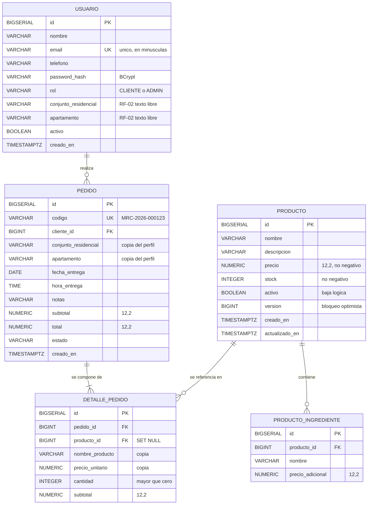

# Modelo de datos — MrCatFood

| Campo | Valor |
|---|---|
| Proyecto | MrCatFood — sistema de pedidos de sándwiches |
| Tarea | M1.3 · Modelar casos de uso y entidades (modelo de datos) |
| Versión | 1.0 |
| Estado | En revisión (Pull Request) |
| Motor de persistencia | PostgreSQL 16 · migraciones con Flyway |

## 1. Convenciones

- Los nombres de tabla y columna van en `español_snake_case`.
- Las claves primarias son `BIGSERIAL` (identificador surrogate).
- Los precios usan `NUMERIC(12,2)`: nunca punto flotante, para no acumular errores de redondeo.
- Las fechas y horas se guardan con zona: `TIMESTAMPTZ` para instantes, `DATE` y `TIME` para fecha y hora de entrega.
- Todo importe o cantidad que calcula el sistema es verificable contra una regla de negocio.

## 2. Diagrama entidad-relación



Los campos marcados como `copia` son los que sostienen el requisito RNF-04; ver seccion 4.1.


## 3. Entidades

### 3.1 `usuario`

| Columna | Tipo | Restricciones | Descripción |
|---|---|---|---|
| `id` | BIGSERIAL | PK | Identificador |
| `nombre` | VARCHAR(120) | NOT NULL | Nombre completo |
| `email` | VARCHAR(180) | NOT NULL, UNIQUE | Correo de acceso, se normaliza a minúsculas |
| `telefono` | VARCHAR(30) | NOT NULL | Contacto para la entrega |
| `password_hash` | VARCHAR(100) | NOT NULL | Hash BCrypt; la contraseña nunca se guarda |
| `rol` | VARCHAR(20) | NOT NULL | `CLIENTE` o `ADMIN` |
| `conjunto_residencial` | VARCHAR(120) | NULL | RF-02, texto libre del cliente |
| `apartamento` | VARCHAR(60) | NULL | RF-02, texto libre del cliente |
| `activo` | BOOLEAN | NOT NULL, default TRUE | Permite desactivar sin borrar |
| `creado_en` | TIMESTAMPTZ | NOT NULL, default NOW() | Fecha de registro |

**Índice:** `ix_usuario_email` sobre `LOWER(email)`, porque RN-06 exige comparar el correo sin distinguir mayúsculas.

### 3.2 `producto`

| Columna | Tipo | Restricciones | Descripción |
|---|---|---|---|
| `id` | BIGSERIAL | PK | Identificador |
| `nombre` | VARCHAR(120) | NOT NULL | Nombre del sándwich |
| `descripcion` | VARCHAR(600) | NULL | Descripción |
| `precio` | NUMERIC(12,2) | NOT NULL, CHECK (>= 0) | Precio en COP |
| `stock` | INTEGER | NOT NULL, CHECK (>= 0) | Inventario disponible, RF-05 |
| `activo` | BOOLEAN | NOT NULL, default TRUE | Baja lógica: RF-03 solo muestra activos |
| `version` | BIGINT | NOT NULL, default 0 | Versionado optimista para el stock |
| `creado_en` | TIMESTAMPTZ | NOT NULL, default NOW() | |
| `actualizado_en` | TIMESTAMPTZ | NOT NULL, default NOW() | |

`version` es la defensa contra la condición de carrera de RN-01: si dos clientes confirman el último sándwich a la vez, solo uno gana la actualización y el otro recibe el error de stock insuficiente.

### 3.3 `producto_ingrediente`

| Columna | Tipo | Restricciones | Descripción |
|---|---|---|---|
| `id` | BIGSERIAL | PK | Identificador |
| `producto_id` | BIGINT | FK → `producto(id)`, ON DELETE CASCADE | Producto al que pertenece |
| `nombre` | VARCHAR(120) | NOT NULL | Ingrediente del sándwich |
| `precio_adicional` | NUMERIC(12,2) | NOT NULL, default 0 | Sobrecosto opcional del ingrediente |

Relación N:N entre producto e ingrediente resuelta como tabla intermedia. Permite que un mismo ingrediente aparezca en varios sándwiches.

### 3.4 `pedido`

| Columna | Tipo | Restricciones | Descripción |
|---|---|---|---|
| `id` | BIGSERIAL | PK | Identificador |
| `codigo` | VARCHAR(20) | NOT NULL, UNIQUE | Código legible, por ejemplo `MRC-2026-000123` |
| `cliente_id` | BIGINT | FK → `usuario(id)`, NOT NULL | Quién hizo el pedido |
| `conjunto_residencial` | VARCHAR(120) | NOT NULL | **Copia** del perfil en el momento del pedido (RNF-04) |
| `apartamento` | VARCHAR(60) | NOT NULL | **Copia** del perfil en el momento del pedido (RNF-04) |
| `fecha_entrega` | DATE | NOT NULL | RF-07 |
| `hora_entrega` | TIME | NOT NULL | RF-07 |
| `notas` | VARCHAR(500) | NULL | Indicaciones adicionales del cliente |
| `subtotal` | NUMERIC(12,2) | NOT NULL | Suma de los detalles |
| `total` | NUMERIC(12,2) | NOT NULL | Total cobrado |
| `estado` | VARCHAR(30) | NOT NULL | Estado actual, ver §5 |
| `creado_en` | TIMESTAMPTZ | NOT NULL, default NOW() | |

**Índices:** `ix_pedido_cliente` sobre `(cliente_id, creado_en DESC)` para el historial del cliente; `ix_pedido_estado` sobre `(estado, fecha_entrega)` para los filtros de la administradora.

### 3.5 `detalle_pedido`

| Columna | Tipo | Restricciones | Descripción |
|---|---|---|---|
| `id` | BIGSERIAL | PK | Identificador |
| `pedido_id` | BIGINT | FK → `pedido(id)`, ON DELETE CASCADE | Pedido al que pertenece |
| `producto_id` | BIGINT | FK → `producto(id)`, ON DELETE SET NULL | Producto actual, puede quedar nulo |
| `nombre_producto` | VARCHAR(120) | NOT NULL | **Copia** del nombre (RNF-04) |
| `precio_unitario` | NUMERIC(12,2) | NOT NULL | **Copia** del precio (RNF-04) |
| `cantidad` | INTEGER | NOT NULL, CHECK (> 0) | Unidades pedidas |
| `subtotal` | NUMERIC(12,2) | NOT NULL | `precio_unitario × cantidad` |

## 4. Decisiones de diseño y su justificación

### 4.1 Por qué se copian el nombre, el precio y la ubicación (RNF-04)

Si `detalle_pedido` guardara solo `producto_id` y consultara el precio actual, un pedido de marzo cambiaría de valor cuando la administradora subiera el precio en junio. Al copiar `nombre_producto` y `precio_unitario`, y `conjunto_residencial` y `apartamento` en `pedido`, el histórico es inmutable: es lo que exige el requisito de integridad.

`producto_id` se conserva con `ON DELETE SET NULL` para mantener el vínculo con el catálogo sin impedir borrar un producto retirado.

### 4.2 Por qué `NUMERIC(12,2)` y no `DOUBLE`

Los importes se suman y se comparan contra valores esperados en las pruebas. Con coma flotante, `0.1 + 0.2` no da `0.3` y una comparación de igualdad en una prueba falla de forma intermitente. `NUMERIC` es exacto.

### 4.3 Por qué `version` en `producto`

Dos clientes pueden confirmar pedidos del último sándwich en paralelo. Sin control de concurrencia, ambos leen el mismo stock y ambos escriben, y el inventario queda negativo. El versionado optimista hace que el segundo `UPDATE` afecte cero filas y la transacción se revierta con el error de stock insuficiente (RN-01, criterio de HU-10).

### 4.4 Por qué `activo` en vez de borrar

RF-03 pide mostrar solo los disponibles y RNF-05 pide poder actualizar la información del negocio. Desactivar conserva el histórico de los pedidos ya hechos y permite volver a ofrecer el producto sin volver a escribir sus datos.

### 4.5 Por qué el conjunto y el apartamento son texto libre

Se decidió que el cliente escriba libremente sus datos de ubicación. El modelo no exige un catálogo de conjuntos, lo que evita el trabajo de mantenerlo y acepta la Flexibilidad de quien registra. El precio de esa decisión es que puede haber inconsistencias de escritura; se asume conscientemente porque el volumen es bajo y la administradora revisa los pedidos.

## 5. Estados del pedido

```
PENDIENTE ─────► CONFIRMADO ─────► EN_PREPARACION ─────► ENTREGADO
     │                │                    │                   │
     └────────────────┴────────────────────┴───────────────────┴────► CANCELADO
```

| Estado | Significado | Efecto en el inventario |
|---|---|---|
| `PENDIENTE` | El cliente confirmó y el negocio aún no lo vio | Ya descontado |
| `CONFIRMADO` | El negocio confirmó la recepción | Ya descontado |
| `EN_PREPARACION` | Se está preparando | Ya descontado |
| `ENTREGADO` | Se entregó al cliente | Ya descontado |
| `CANCELADO` | Se canceló por el motivo que sea | **Devuelto** (RN-04) |

Las transiciones no previstas (por ejemplo, de `ENTREGADO` a `PENDIENTE`) se rechazan con error de regla de negocio.

## 6. Integridad referencial

| Relación | Cardinalidad | Borrado |
|---|---|---|
| `pedido.cliente_id` → `usuario.id` | N:1 | Sin acción: no se borran usuarios con pedidos |
| `detalle_pedido.pedido_id` → `pedido.id` | N:1 | CASCADE: al borrar el pedido se borran sus detalles |
| `detalle_pedido.producto_id` → `producto.id` | N:1 | SET NULL: el pedido sobrevive al producto |
| `producto_ingrediente.producto_id` → `producto.id` | N:1 | CASCADE: al borrar el producto se borran sus ingredientes |

## 7. Trazabilidad de esta tarea

| Elemento | Ubicación |
|---|---|
| Tarea del backlog | M1.3 — ver `docs/modulos-backlog.md` |
| Requisitos de origen | M1.1 — `docs/especificacion-requisitos.md` |
| Casos de uso | M1.3 — `docs/casos-de-uso.md` |
| Implementación de las migraciones | M2.2 y M4.1 — ver `docs/modulos-backlog.md` |